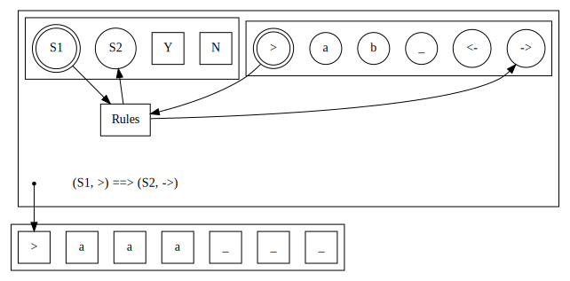
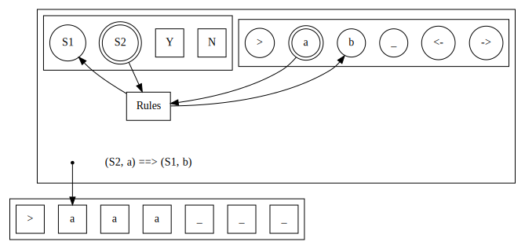
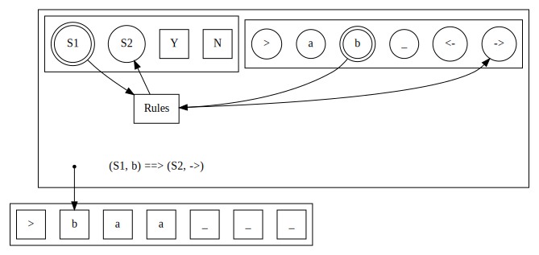
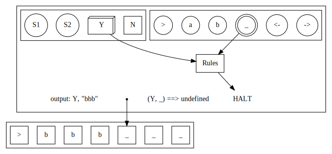

<!-- _class: lead invert -->

# The Halting Problem
##  Will this ever end?

---

# Objectives

- Give a mathematical model of an algorithm and a computer
- Present the Church-Turing Thesis.
- Understand the halting problem and find out whether it's possible to write a program that reasons about other programs

---

<!-- _class: lead -->
# Turing Machines

---


---

# Components of a Turing Machine

- **Tape:** consists of an infinite number of cells, each of which could be empty or contains one of a fixed set of letters -- the "memory".

- **Working head:** reads and writes to the tape, and can be moved along the tape to access any cell.

- **Control module:** defines a set of instructions for the machine -- the program.

---

# How it works

- The machine may be in one of a fixed set of *states*.

- Before it starts, we assume that the *input* is written on the tape.

- It begins in a given *initial state*, with the working head on the leftmost cell of the tape (at the $\triangleright$).

- The control module contains a set of instructions which determine what to do when the machine is in a given state and has just read a given letter.

---

# How it works

Each instruction does the following thing:

- Change state,
  
and

  - write a letter on the current cell of the tape, or
  - move working head left $\leftarrow$, or
  - move working head right $\rightarrow$.

---



---




---




---

# Stopping and output

- The set of states contains a number of *halting states*.

- When the machine is in one of these *halting states*, it stops running.

- Its "output" is the state it stopped in and the letters written on the tape when it stopped.
---



---

# Programming with a Turing Machine

The set of instructions which determine what the turing machine will do is called the transition function.

For example:
- If I read an $a$ and I'm in state $S_2$, then write a $b$ and move to state $S_1$,
- If I read a $b$ and I'm in state $S_1$, then move to state $S_2$ and move right.

---
## Partial function

Mathematically, the transition function is a partial function. I.e.,
- Given some letter $x$ and some (non-halting) state $Y$, the transition function defines exactly one action. 
- Actions for every combination of letter and non-halting state are defined.

---
# Example 

## Even or odd length

Given a word of all $a$'s, decide whether its length is even or odd.

The word is written on the tape as follows
$$
\triangleright \mid a \mid a \mid \cdots \mid a \mid \sqcup \mid \sqcup \mid \cdots
$$
and the working head is initially at the start of the tape (reading $\triangleright$).

---

## Pseudo-code

- Read word one letter at a time.
- Flip-flop between two states: one  for even one for odd.
- When every letter in the word is read, halt with either **YES** or **NO**.

---

## Coding the transition function

Turing machines are very low-level. We don't have nice constructs like loops and conditionals.

Instead we'll have to code it up using states to represent odd and even length, and read the word by moving right.

---
# Defining the machine 

- States: $\{ E, O, Y, N \}$,
- Halting states: $\{ Y, N \}$ ($Y$ for yes it's even, $N$ for no it's not)
- Initial state: $E$.

---
# Defining the transition function

| State | Letter           | New State | Operation      |
| ----- | ---------------- | --------- | -------------- |
| $O$   | $\triangleright$ | $E$       | $\rightarrow$  |
| $E$   | $\triangleright$ | $E$       | $\rightarrow$  |
| $O$   | $a$              | $E$       | $\rightarrow$  |
| $E$   | $a$              | $O$       | $\rightarrow$  |
| $O$   | $\sqcup$         | $N$       | $\sqcup$       |
| $E$   | $\sqcup$         | $Y$       | $\sqcup$       |

---
# Exercises

Build Turing Machines to solve the following problems

1.
    - **Input:** a string of only $a$'s
    - **Output:** deletes every letter and HALT.

1. 
    - **Input**: A string which may contain $a$'s, $b$'s, or a mixture of both.
    - **Output:** YES if the input string contains only $a$'s, NO otherwise. 

1. 
    - *How might you modify the TM you just built to output YES if the input consists of only $a$'s or only $b$'s?*

1.
    - **Input**: A string which may contain $a$'s, $b$'s, or a mixture of both.
    - **Output:** YES if the string contains the same number of $a$'s and $b$'s, NO otherwise.


---

<!-- _class: lead -->

# The Universal Turing Machine

---

# The Universal Turing Machine

A special Turing machine which can run other Turing Machines on a given input.

---

Somewhat like an interpreter, the Universal Turing Machine $U$ takes as input
- $M$: an encoding of a Turing Machine (source code)
- $w$: the input to run $M$ on.

Then:
- $U$ writes the instructions for the machine $M$ on its tape, followed by the input $w$.
- It then runs the instructions for $M$ on the input $w$ and returns its output (via states and the tape). 

---
# Turing Completeness

A programming language is called **turing complete** if it can be used to build the Universal Turing Machine.

Not all computer languages are Turing complete.

---

# For example

## Turing Complete

- Most general-purpose programming languages.
- E.g., C / C++, Java Python. 
- More surprisingly, Emacs (lisp), Vim and even, one could argue, LaTex!

## Not Turing Complete

- Many markup languages.
- E.g., HTML, CSS, Markdown.
- Also some querying languages, e.g., ANSI SQL
- (Vanilla) regular Expressions

---

# Brainf*ck

- An esoteric programming language.
- It *is* turing complete...
- Although there are only 8 commands!
- See https://en.wikipedia.org/wiki/Brainfuck

## Hardcore Exercise

- In a (Turing complete) language of your choice, build a Brainf\*ck interpreter! 
- Extension: build a C++ compiler in Brainf\*ck!

---

<!-- _class: lead -->

# The Church-Turing Thesis

---

 # Statement

One useful way of stating the church-Turing Thesis is:

> **Any algorithm can be implemented using a Turing Machine.**

---

# Evidence in favour

- Every attempt to program algorithms on Turing machines worked so far

- All versions of the Turing machine have been proved to be equivalent

- All other models of algorithm have been proved to be equivalent to Turing Machines (see, e.g., the lambda calculus)

---
<!-- _class: lead -->

# The Halting Problem

## Please tell me whether it's going to end!

---

# Infinite loops

Some programs run forever.

For example:
```
let num = 0;

while (true) {
    num = num + 1;
}
```

It's easy [for a human] to see that this won't halt.

---

# Semi-decidable sets

- If we code this up as a Turing Machine (Church-Turing says we can), it will never enter a halting state.

- Some Turing Machines halt and give us an answer, while others will run forever!

- The set of all Turing Machines is called *semi-decidable*.

---

# Exercise

1. Design a Turing Machine which never halts.

---

# Exercise

1. Design a Turing Machine which never halts.

1. What if we're only allowed to use finitely many cells of the tape?

---

# A program and its input

Does this program always halt?

```
let n = user_input();
let fac = 1;

while (n != 0) {
    fac = fac * n;

    n = n - 1;
}

return fac;
```

---

# The Halting Problem

**Input**
- $M$: a Turing machine (e.g., some program code)
- $w$: an input for $M$.

**Output:** 
- **YES** if $M$ halts on $w$, **NO** otherwise.

Is it possible to write a program to solve this problem?

---

<!-- _class: lead -->
# Russell's Paradox and Self-Reference

---

# Computers are stupid

Computers can perform a sequence of specific instructions with speed and accuracy.

But they don't "understand" what they are doing.

---

# Self-reference

In order to determine whether our input program will halt, the computer will neeed to understand what the program does.

In other words, it would need to understand itself!

---

<!-- _class: lead -->


> **Mathematics may be defined as the subject in which we never know what we are talking about, nor whether what we are saying is true.** -- Bertrend Russell

---

# Quick aside on set theory

- A set is a "bag of things".
- The things could be anything -- numbers; people; zombies, ghosts and skeletons; even sets. 
- Sets may be finite, e.g., the set of all people in the world,
- Infinite but countable, e.g., the set of natural (counting) numbers, 
- or infinite and uncountable, e.g., the real (decimal) numbers. 

---

# Defining Sets

We can define a set using properties of its elements.

E.g.,
- $\{ p \in P \mid \text{Person } p \text{ likes dogs.} \}$ 
- $\{ x \in \mathbb{Z} \mid x \text{ is even} \}$

---

# Sets of sets

We can also define sets of sets in this way. Let $\cal U$ be the set of all possible sets, then
$$
\{ A \in \mathcal{U} \mid A \text{ has exactly two elements } \}.
$$

**Question:** is this set finite or infinite?

---

# The Russell Set

Now let's define the Russell Set
$$
R := \{ A \in \mathcal{U} \mid A \not \in A \}.
$$

In words

> The set of all sets that do not contain themselves.

**Question:** is $R$ a member of itself?

---

# Russell's Paradox
## Yes!

- Suppose that $R \in R$,
- By the definition, $R$ cannot contain itself,
- So $R \not \in R$.

**Contradiction!** An element cannot be both *in* and *not in* a set at the same time.

---

# Russell's Paradox
## Then the answer must be no!

- Suppose $R \not \in R$.
- So far, so good, it satisfies the property $R \not \in R$ from the definition.
- But that means $R \in R$, and we get another contradiction!

---

# Paradox

- Either $R \in R$ or $R \not \in R$,
- but both situations lead to a contradiction!

---

# The Barber Paradox

There is a remote village where only one barber, a lovely fella called Bill, lives.

Bill has some strict morals about who he will shave.

**Bill shaves every resident, and only those residents, who do not shave themselves.**

**Question:** Does Bill shave himself?

<!-- 
Yes: then the barber shaves himself and cannot be the barber.
No: he is one of the people who is shaved by the barber, but as he is the barber, he does shave himself.
-->

---
<!-- _class: lead -->
# Back to the Halting Problem

## Using self-reference to explain why there can be no solution

---

# Proof by contradiction

Assume we have a program `halts`.

**Input:** 
- $M$: the source code of a program
- $w$: some input

**Output:** **YES** if $M$ halts on $w$, **NO** if $M$ does not halt on $w$.

---


*Diagram of `halts` machine.*

I.e., assume we have solved the halting problem.

---

# Self-reference

Now we define another program `contra` as follows:

**Input:**
- $M$: program source code

**Output:**
- Halt with **YES** if $M$ **does not** halt on itself,
- Otherwise, **do not halt**

---


*Diagram of `contra` machine, which assumes `halts` always returns YES or NO.*

---

# Self-reference

`contra` is a program, and it takes a program as input...

**Run `contra` on itself!**

---

# Contradiction

- If `contra' halts on 'contra', 
- Our 'halts' program returns YES.
- Then 'contra' enters the forever `loop()`.
- Thus `contra` **does not** halt on `contra`.

---

# Contradiction

- If `contra` does not halt on `contra`,
- `halts` outputs NO, and the `contra` program halts.
- Another contradiction!

---

# Consequence

**Programming is hard!**

It is not possible to automatically check if any program we write is correct

Large companies (Meta, Microsoft, Google etc) are developing tools to automatically check *some* types of programs, but it will never be possible to check every program.

In some safety-critical applications, restrictions are made on the types of programs that can be written, and these can be verified. 

---
<!-- _class: lead invert -->

# Thank-you

## I hope you enjoyed it! 

# 🤯 🤯 🤯
